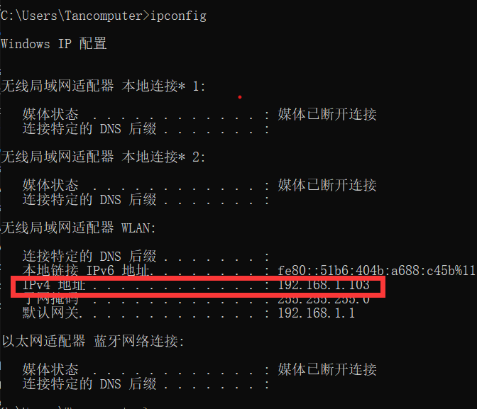

计算机本科毕业设计，全栈项目，技术栈有前端主要是Vue3，后端koa2、mysql。目前功能主要有图片翻译、语言翻译和文本翻译，翻译是对接的百度翻译api，后端部分持续更新中。。。
项目效果：https://handytranlate.top
运行之前不要忘记把.env和/server/.env中的数据库账号密码和百度翻译的appid和密钥替换成自己的

##  前端部分
### 运行
npm版本是8.19.2
nodejs版本是16.18.1
若需要在自己手机上测试，并且是处于局域网网络状态下，可以在命令行中输入ipconfig查看的局域网IP地址，如下图，然后运行的时候替换成你的局域网，运行成功就可以在手机浏览器中局域网地址访问啦，tip:首次运行不要忘记npm i加载依赖哦
npm run dev -- --host 192.168.1.103

## 后端部分
cd server
npm run dev

# Vue 3 + Vite
This template should help get you started developing with Vue 3 in Vite. The template uses Vue 3 `<script setup>` SFCs, check out the [script setup docs](https://v3.vuejs.org/api/sfc-script-setup.html#sfc-script-setup) to learn more.

## Recommended IDE Setup

- [VS Code](https://code.visualstudio.com/) + [Volar](https://marketplace.visualstudio.com/items?itemName=Vue.volar) (and disable Vetur) + [TypeScript Vue Plugin (Volar)](https://marketplace.visualstudio.com/items?itemName=Vue.vscode-typescript-vue-plugin).
